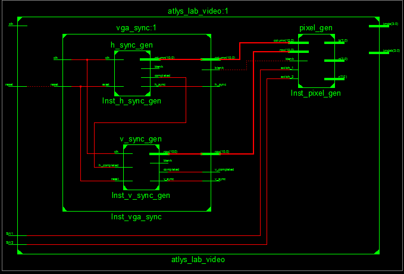

vgalab
======

Introduction

VGA Synchronization 

This lab focused on using simple readable code and mealy or moore machines to get an FPGA to sync with a monitor via dvi
to HDMI.

Implementation

Test/Debug

Since I chose not to originally implement my code using the techniques given in the book I had a lot of problems that were
hard to diagnose. Eventually, at the instructors behest, I recoded and found that my test bench worked for the h_sync_gen.
When encountering problems at the VGA_sync level I created a test bench for it as well. I did not create a testbench for
the top level but simply tested it on the monitor.

Conclusion

I think this lab was a little too difficult for the first lab and would have rather had practice with something that
required a little less data abstraction to get my feet wet before diving in head first with no helmet.
